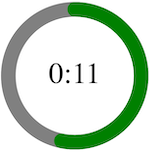

# vue-roundslider

Round slider (can call as Circle slider or Knob slider) component allows the user to select a value or range of values through a circular dial.

## Demo



## How to install

`npm i  @serh/vue-roundslider --save`

## Example

```html
<template>
  <div>
    <VueRoundslider
      :duration="duration"
      :position="position"
      :diametr="300"
      :widthCircle="10"
      :colorLine="colorLine"
      :onPosition="eventPosition"
      :onMouseMoveCenter="eventMouseMoveCenter"
      :onMouseClickCenter="eventMouseClickCenter"
      :onMouseMovePosition="eventMouseMovePosition"
    ></VueRoundslider>
  </div>
</template>

<script>
import VueRoundslider from "@serh/vue-roundslider";
const COLOR_LINE_DEFAULT = "green";
const COLOR_LINE_END = "blue";
export default {
  data: () => ({
    duration: 20,
    position: 5,
    colorLine: COLOR_LINE_DEFAULT,
    timerInterval: null,
    mouseMoveCenter: false,
  }),
  watch: {
    position: function (val) {
      if (val >= this.duration) {
        clearInterval(this.timerInterval);
        this.timerInterval = null;
        this.colorLine = COLOR_LINE_END;
      } else {
        this.colorLine = COLOR_LINE_DEFAULT;

        if (!this.timerInterval) {
          this.positionInterval();
        }
      }
    },
    mouseMoveCenter: function (val) {
      if (val === true) {
        console.log("Mouse over center");
      } else {
        console.log("Mouse out center");
      }
    },
  },
  mounted() {
    this.positionInterval();
  },
  components: {
    VueRoundslider,
  },
  methods: {
    positionInterval() {
      this.timerInterval = setInterval(() => (this.position += 1), 1000);
    },
    eventPosition(position) {
      this.position = position;
    },
    eventMouseMoveCenter(event) {
      this.mouseMoveCenter = true;
    },
    eventMouseMovePosition(event) {
      this.mouseMoveCenter = false;
    },
    eventMouseClickCenter(event) {
      console.log("Click Center");
    },
  },
};
</script>

<style scoped lang="scss">
</style>

```

### Props

| name              | type           | default      | description
| --- | --- | --- | --- |
| duration | Number | 100 | The url of the sound to play.| The max property indicates the maximum value of the slider. |
| diametr | Number | 100 | Indicates diametr of the slider. |
| widthCircle | Number | 7 | Width of the drawn line |
| colorLine | String | green | Color of the drawn line | 
| position | Number | 0 | Current position slider | 
| onPosition | Function | function(){} | Callback function when slider changes |
| onMouseMoveCenter | Function | function(){} | Callback function when mouse over center |
| onMouseClickCenter | Function | function(){} | Callback function when mouse click center |
| onMouseMovePosition | Function | function(){} | Callback function when move change position |
| formatTime | Boolean | true | Format duration output how time |

